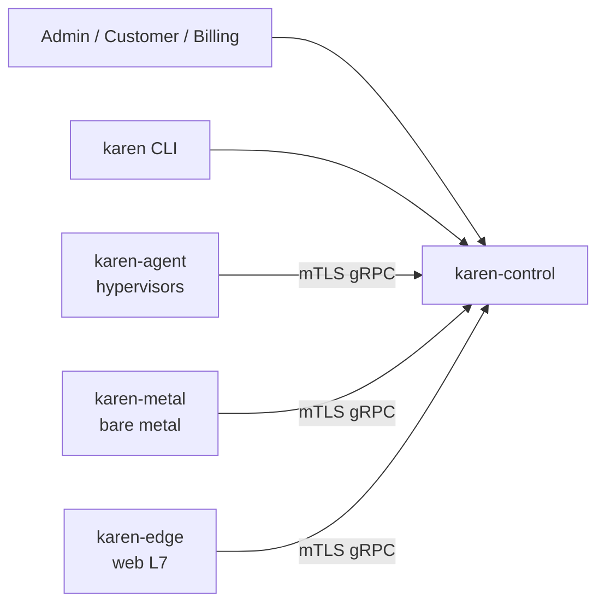

<div align="center">

# KAREN

**Kernel Automation Resource Engine & Networking**

Open-source platform to run a hosting company: VPS, dedicated servers and website hosting. An MIT alternative to VirtFusion, Virtualizor, SolusVM — and to stacking cPanel + CloudLinux + LiteSpeed licenses.

[](./LICENSE)
[](https://rust-lang.org)
[](./ROADMAP.md)

[Why](#why) · [Architecture](#architecture) · [Features](#features) · [Roadmap](./ROADMAP.md) · [Competitors](./docs/COMPETITORS.md) · [Contributing](./CONTRIBUTING.md)

</div>

---

> **Status: pre-alpha.** Nothing here runs yet. This repo is the design and the plan. See [ROADMAP.md](./ROADMAP.md).

KAREN turns a pile of Linux/KVM boxes and bare-metal servers into a hosting company: VPS, dedicated servers and website hosting from one control plane, with small Rust agents on hypervisors, the bare-metal network and the web edge.

Static Rust binaries. No PHP, no Node, no Docker required. Your hardware, your license, no per-node fees.

## Why

| Problem today | KAREN |
|---|---|
| VirtFusion / Virtualizor / SolusVM are closed source with per-node licensing | MIT, free, auditable |
| PHP monoliths, ionCube-encoded, hard to extend | Rust core, plugin crates, public API first |
| Licensed web stack: cPanel charges $0.49/account over 100, with price increases in 2027; plus CloudLinux and LiteSpeed licenses | Container-per-account isolation + Pingora-based edge, no per-account fees |
| Open-source panels are Proxmox wrappers (Convoy, Vormox, FeatherPanel) | Standalone: talks to KVM, storage, network and BMCs directly |
| OpenStack / CloudStack are heavy for 1–50 node hosts | Single binary per role; runs on a $4 VPS for the control plane |

## Architecture



Full design: [docs/ARCHITECTURE.md](./docs/ARCHITECTURE.md). Research behind it: [docs/research/](./docs/research/).

Design rules (same philosophy as [vkdg](https://github.com/vkdprojects/vkdg)):

- **Rust everywhere.** Single static binaries, no runtime.
- **API first.** The UI is just an API client. Everything the UI does, a script can do.
- **Agent is dumb, control plane is the brain.** Agents execute idempotent tasks; state lives in one place.
- **Plugins, not forks.** Storage backends, network modes, billing modules are crates behind traits.
- **Boring tech.** QEMU/libvirt, PostgreSQL, nftables, OVN, cloud-init. No custom hypervisor.

## Features

Target scope for v1.0. Progress tracked in [ROADMAP.md](./ROADMAP.md).

**VPS**
- QEMU/KVM via libvirt; Cloud Hypervisor tier for Linux cloud images later
- Create, start, stop, reboot, reinstall, resize, rescue, destroy
- cloud-init templates, ISO boot, Windows (OVMF, vTPM)
- Snapshots, live migration with local disks
- Host hardening: nested virt off by default

**Dedicated (metal)**
- `karen-metal`: power, serial console and inventory via Redfish + IPMI
- UEFI HTTPS Boot → iPXE → Rust ramdisk agent for installs
- NVMe crypto-erase on release, fail closed
- Switch-port VLAN automation

**Web hosting**
- One container per account (cgroup v2, user namespaces, per-account PHP-FPM)
- `karen-edge`: Pingora-based L7 proxy with on-demand ACME
- Firecracker microVMs for apps, scale-to-zero
- One-click apps (n8n, etc.) on VPS

**Network**
- Routed mode and OVN mode; anti-spoof in both
- IPv4 `/32` + IPv6 `/64` per VM, rDNS via PowerDNS
- BGP to the host (FRR), per-VM rate limits
- Edge kit: IX.br, RPKI, FastNetMon → RTBH/Flowspec

**Firewall**
- Per-VM firewall, stateless by default, same API in both modes, nftables or OVN ACLs underneath, deny logging

**Graphs & accounting**
- 10 s per-VM network graphs, 5-min traffic accounting, 95th-percentile billing
- Prometheus metrics, VictoriaMetrics storage

**Storage**
- Local NVMe on LVM-thin (default), Ceph RBD volumes
- Incremental, deduplicated backups to S3; PBS as a target

**Business**
- Admin, reseller and customer roles; plans with traffic quotas
- WHMCS first, then Blesta and Paymenter
- Hourly billing with credit balance and auto-suspend
- REST API + OpenAPI, scoped tokens, webhooks, audit log

## Quick start

Not available yet. Target UX:

```bash
# control plane
cargo install --git https://github.com/vkdprojects/karen karen-control karen-agent
karen-control serve

# each hypervisor
karen-agent enroll https://panel.example.com --token <one-time-token>
```

## Repository layout (planned)

```
apps/web/              # UI (SPA, embedded in karen-control)
crates/karen-control/  # control plane binary
crates/karen-agent/    # hypervisor agent binary
crates/karen-metal/    # bare-metal provisioner binary
crates/karen-edge/     # Pingora L7 edge for web hosting
crates/karen-cli/      # admin CLI
crates/karen-proto/    # gRPC/protobuf contracts
crates/karen-core/     # domain types, scheduler, IPAM
plugins/storage/*      # lvm-thin, ceph
plugins/network/*      # routed, ovn
plugins/billing/*      # whmcs, blesta, paymenter bridges
api/openapi.yaml       # REST contract (source of truth)
docs/                  # ARCHITECTURE.md, spec/, research/
AGENTS.md, .agents/    # rules and playbooks for AI coding agents
```

## Contributing

See [CONTRIBUTING.md](./CONTRIBUTING.md). Security issues: [SECURITY.md](./SECURITY.md).

## License

MIT. See [LICENSE](./LICENSE).
