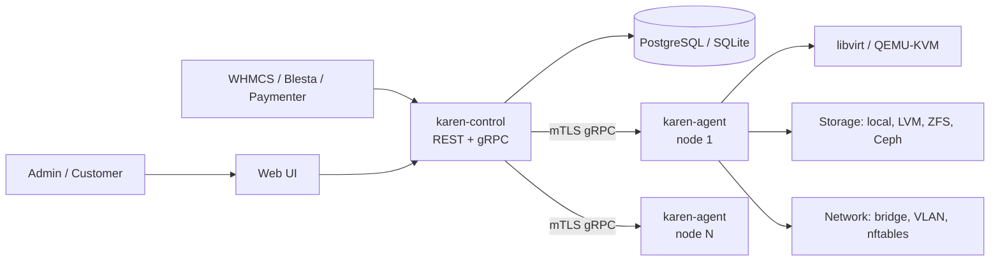

<div align="center">

# KAREN

**Kernel Automation Resource Engine & Networking**

Self-hosted VPS control panel in Rust. An open-source alternative to VirtFusion, Virtualizor and SolusVM.

[](./LICENSE)
[](https://rust-lang.org)
[](./ROADMAP.md)

[Why](#why) · [Architecture](#architecture) · [Features](#features) · [Roadmap](./ROADMAP.md) · [Competitors](./docs/COMPETITORS.md) · [Contributing](./CONTRIBUTING.md)

</div>

---

> **Status: pre-alpha.** Nothing here runs yet. This repo is the design and the plan. See [ROADMAP.md](./ROADMAP.md).

KAREN turns a pile of Linux/KVM boxes into a VPS hosting platform: a control plane that schedules and provisions VMs, and a tiny agent on each hypervisor that talks to libvirt/QEMU, storage and the network.

Two static binaries. No PHP, no Node, no Docker required. Your hardware, your license, no per-node fees.

## Why

| Problem today | KAREN |
|---|---|
| VirtFusion / Virtualizor / SolusVM are closed source with per-node licensing | MIT, free, auditable |
| PHP monoliths, ionCube-encoded, hard to extend | Rust core, plugin crates, public API first |
| Proxmox is great virtualization but not a hosting panel (no end-user portal, billing hooks, IP pools per customer) | Hosting-first: tenants, plans, IPAM, billing integrations |
| OpenStack / CloudStack are heavy for 1–50 node hosts | Single binary per role; runs on a $4 VPS for the control plane |

## Architecture



| Component | Role |
|---|---|
| `karen-control` | API, scheduler, IPAM, users/RBAC, task queue, web UI (embedded) |
| `karen-agent` | Runs on each hypervisor. VM lifecycle, storage, network, metrics, VNC proxy |
| `karen` CLI | Admin ops, bootstrap, node enrollment |
| `crates/` | Shared types, protocol, plugins (storage, network, billing) |

Design rules (same philosophy as [vkdg](https://github.com/vkdprojects/vkdg)):

- **Rust everywhere.** Single static binaries, no runtime.
- **API first.** The UI is just an API client. Everything the UI does, a script can do.
- **Agent is dumb, control plane is the brain.** Agents execute idempotent tasks; state lives in one place.
- **Plugins, not forks.** Storage backends, network modes, billing modules are crates behind traits.
- **Boring tech.** libvirt, PostgreSQL, nftables, cloud-init. No custom hypervisor.

## Features

Target scope for v1.0. Progress tracked in [ROADMAP.md](./ROADMAP.md).

**Virtualization**
- KVM/QEMU via libvirt; LXC/Incus containers later
- Create, start, stop, reboot, reinstall, resize, rescue mode, destroy
- Templates + cloud-init (Linux), ISO boot, Windows images
- Snapshots and scheduled backups (local, S3, PBS)
- Live migration between nodes

**Networking**
- IPv4/IPv6 pools, per-customer allocation, rDNS
- Bridged, routed and VLAN modes
- Anti-spoofing (MAC/IP filtering via nftables)
- Bandwidth limits and traffic accounting

**Storage**
- Local file (qcow2), LVM / LVM-thin, ZFS, Ceph RBD
- Disk I/O limits (IOPS / throughput)

**Hosting panel**
- Admin, reseller and end-user roles
- Plans / packages, hypervisor groups, placement rules
- Browser console (noVNC / xterm.js serial)
- Usage graphs (CPU, RAM, disk, net)
- SSH keys, password reset, OS reinstall from portal

**Integrations**
- REST API + OpenAPI spec, API tokens with scopes
- WHMCS, Blesta, Paymenter modules
- Webhooks, Prometheus metrics, audit log

## Quick start

Not available yet. Target UX:

```bash
# control plane
cargo install --git https://github.com/vkdprojects/karen karen-control karen-agent
karen-control serve

# each hypervisor
karen-agent enroll https://panel.example.com --token <one-time-token>
```

## Repository layout (planned)

```
apps/web/              # UI (SPA, embedded in karen-control)
crates/karen-control/  # control plane binary
crates/karen-agent/    # hypervisor agent binary
crates/karen-cli/      # admin CLI
crates/karen-proto/    # gRPC/protobuf contracts
crates/karen-core/     # domain types, scheduler, IPAM
plugins/storage/*      # local, lvm, zfs, ceph
plugins/network/*      # bridge, routed, vlan
plugins/billing/*      # whmcs, blesta, paymenter bridges
docs/
```

## Contributing

See [CONTRIBUTING.md](./CONTRIBUTING.md). Security issues: [SECURITY.md](./SECURITY.md).

## License

MIT. See [LICENSE](./LICENSE).
