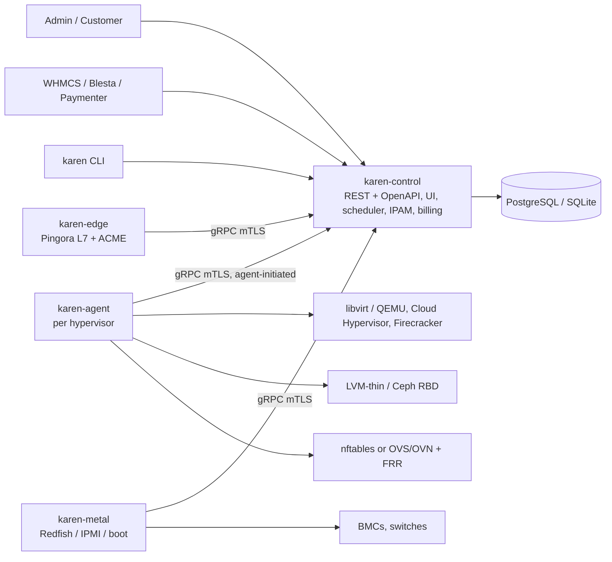
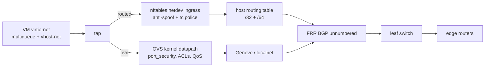
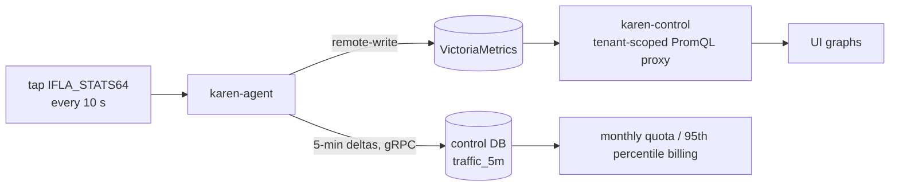
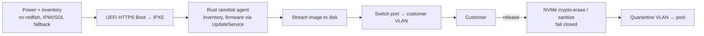

# Architecture

Design decisions for KAREN, backed by the research in [`docs/research/`](./research/). Pre-alpha: this describes the target, not running code.

## Products

| SKU | What's sold | Runtime | Storage | Network mode |
|---|---|---|---|---|
| `vps` | KVM virtual servers (Linux, Windows, custom ISO) | QEMU/KVM via libvirt; later Cloud Hypervisor for a Linux cloud-image tier | Local NVMe (LVM-thin); Ceph RBD volumes for HA plans | `routed` (single node) or `ovn` (multi-node) |
| `metal` | Dedicated / bare-metal servers | Physical hardware driven by `karen-metal` | Customer's local disks | Routed leaf port + switch ACLs; VLAN per customer for private L2 |
| `web` | Website / app hosting | One container per account; Firecracker microVMs for the app tier | Local NVMe, per-user overlay | Behind `karen-edge` (Pingora L7) |

## Components



| Binary / crate | Role |
|---|---|
| `karen-control` | REST API + OpenAPI, scheduler, IPAM, users/RBAC, billing, task queue, web UI (embedded) |
| `karen-agent` | Per hypervisor: libvirt/QEMU, Cloud Hypervisor, Firecracker, LVM-thin, nftables/OVS, metrics, console proxy |
| `karen-metal` | Bare metal: Redfish/IPMI, HTTPS boot server, ramdisk agent, switch-port VLAN state machine |
| `karen-edge` | Pingora-based L7 proxy for `web`: TLS, on-demand ACME, per-site rate limits |
| `karen` CLI | Admin ops, bootstrap, node enrollment |
| `karen-core` | Domain types, scheduler, IPAM logic |
| `karen-proto` | gRPC over mTLS. Agents open the connection, so they work behind NAT |
| `plugins/{storage,network,billing}` | Backends behind traits |

## Invariants

1. The control plane owns state. Agents hold none they can't rebuild.
2. Agent tasks are idempotent and retryable.
3. Every network mode enforces anti-spoof. No mode ships without it.
4. No proprietary or AGPL code is linked. External AGPL/GPL tools (PBS, FastNetMon) are talked to over a protocol only.
5. Nested virtualization is off unless the SKU opts in.

## Compute

```rust
pub trait Vmm: Send + Sync {
    fn kind(&self) -> VmmKind; // Qemu | CloudHypervisor | Firecracker
    async fn create(&self, spec: &VmSpec) -> Result<VmHandle>;
    async fn start(&self, id: &VmId) -> Result<()>;
    async fn stop(&self, id: &VmId, force: bool) -> Result<()>;
    async fn destroy(&self, id: &VmId) -> Result<()>;
    async fn resize(&self, id: &VmId, res: &Resources) -> Result<()>;
    async fn snapshot(&self, id: &VmId, name: &str) -> Result<SnapshotId>;
    async fn migrate_out(&self, id: &VmId, dest: &MigrationTarget) -> Result<()>;
    async fn console(&self, id: &VmId, kind: ConsoleKind) -> Result<ConsoleStream>; // Vnc | Serial
}
```

| Role | VMM | Interface | Why | Limits |
|---|---|---|---|---|
| VPS (primary, v0.1) | QEMU 11.x / KVM via libvirt 12.x | Agent emits domain XML; QMP for gaps | Only VMM with Windows, ISO, VNC, OVMF Secure Boot NVRAM, vTPM, VFIO, local-disk live migration (NBD mirror) | Larger attack surface → hardening below |
| VPS Linux tier (v0.7) | Cloud Hypervisor v53+ | Its REST API (not the libvirt `ch` driver) | Rust, smaller surface | No ISO or graphical console; Windows install needs QEMU; migration doesn't move disks |
| `web` app tier (v0.7) | Firecracker 1.17+ | MMIO transport, jailer | ≤5 MiB overhead, ≤125 ms boot | No Windows, ISO or live migration → never for VPS |

Host hardening baseline (applied and checked by `karen-agent`):
- Nested virt **off** by default: `kvm_intel nested=0` / `kvm_amd nested=0` (Januscape CVE-2026-53359 and Zapscape CVE-2026-64561 need nesting).
- `/dev/kvm` mode 0660.
- Livepatch + rolling-reboot pipeline (ITScape CVE-2026-46316 on arm64).
- Machine type q35, virtio devices only, no `scsi=on` (QEMU CVE-2026-48914).

Sources: [research/vmm.md](./research/vmm.md).

## Network

Exactly two modes. VLAN is OVN `localnet`, NAT is OVN NAT; there is no third code path.

| Mode | When | Dataplane | Anti-spoof |
|---|---|---|---|
| `routed` | P0, single node, behind Hetzner/OVH-style upstreams | Per-VM tap, static `/32` + routed `/64`, proxy ARP/NDP, `tc` police. No Linux bridge, no MacVTap | nftables `netdev` ingress on each tap |
| `ovn` | P1+, multi-node | OVS 3.7 LTS kernel datapath + OVN 26.09 + FRR 10.7; Geneve VPC; `qos_max_rate` + pps meters | OVN `port_security` |



Fabric phases:

| Phase | Topology | Network |
|---|---|---|
| P0 – single node (v0.1–0.3) | One host behind the upstream provider's router | `routed` mode |
| P1 – one rack (v0.4) | 2 leaves (SONiC/Cumulus, 25/100G); dual-homed hosts, BGP unnumbered, no LACP | `ovn` mode; OVN all-in-one → 3-node RAFT NB/SB. Own ASN, transits, IX.br, RPKI, FastNetMon |
| P2 – multi-rack | 2–4 spines, 3-stage Clos, one ASN per leaf pair | OVN live migration, EVPN for bare-metal L2, NetBox + PowerDNS |
| P3 – scale / regions | CX-7 TC offload or BlueField-3 on dense and metal racks; US/EU POPs | OVN-IC across zones, anycast DNS |

Hosts peer BGP unnumbered with their leaves and announce only the VM `/32` and `/128` routes they host (`connected-as-host` + `local-only`). No stretched L2, no MLAG.

Addressing: one IPv4 `/32` + one routed IPv6 `/64` per VM. NetBox 4.7 is the infra source of truth (sites, racks, prefixes, ASNs); the KAREN DB owns per-VM leases and writes back asynchronously. rDNS via the PowerDNS API.

Edge and DDoS: ≥2 transits; 2× IX.br SP ports in different facilities (Equinix SP4 fire, 2025); Routinator RPKI; FastNetMon (sFlow) → RTBH / Flowspec / external scrubber; XDP pre-filter.

Tuning: `fq` + BBR v1; virtio-net multiqueue + vhost-net; underlay MTU 9216 (guests 1500, 8942 inside a VPC); NUMA-local IRQs. Dedicated-CPU plans: 1G hugepages + 1:1 pinning. Shared plans: THP.

Not used: OVS-DPDK by default, AF_XDP (experimental), SR-IOV for VPS, SRv6, stretched L2/MLAG, out-of-tree BBRv3.

Sources: [research/networking.md](./research/networking.md).

## Firewall

**OVS bypasses netfilter.** Traffic switched by the OVS kernel datapath never traverses the netfilter forward/bridge hooks (there is no `br_netfilter` for OVS), so nftables `forward` rules do not filter OVN-mode VMs. OpenStack Neutron solved this with OpenFlow `ct()` rules in its [native OVS firewall driver](https://docs.openstack.org/neutron/latest/contributor/internals/openvswitch_firewall.html), deprecating the old "hybrid" driver that ran iptables on an extra Linux bridge per port. KAREN never mixes nftables and OVS for the customer firewall: each mode has exactly one enforcement engine.

| Layer | Where | Purpose |
|---|---|---|
| 1. Edge | XDP pre-filter + RTBH / Flowspec | DDoS |
| 2. Host anti-spoof | nftables `netdev` ingress (`routed`) / `port_security` (`ovn`) | Always on |
| 3. VM firewall | Per-VM policy below | Customer rules |
| 4. L7 | `karen-edge` (Pingora) per-site rate limits | `web` tier |

`metal` firewall: switch ACLs on the leaf port (v0.6); nothing on the host.

One API object for both modes:

```rust
pub struct FirewallPolicy {
    pub enabled: bool,               // default false
    pub default_inbound: Verdict,    // Allow | Deny
    pub default_outbound: Verdict,   // Allow
    pub rules: Vec<FirewallRule>,    // max 64 per VM
}

pub struct FirewallRule {
    pub direction: Direction,        // In | Out
    pub proto: Proto,                // Tcp | Udp | Icmp | Icmpv6 | Any
    pub ports: Option<RangeInclusive<u16>>,
    pub cidrs: Vec<IpNet>,
    pub action: Verdict,             // Allow | Deny
    pub log: bool,
    pub priority: u16,
}
```

`enabled = false` (default) ⇒ no conntrack, only anti-spoof + rate limits (conntrack costs 2.5–3× pps).

| | `routed` (nftables) | `ovn` (OVN ACL) |
|---|---|---|
| Anti-spoof | `netdev` ingress hook on each tap, always on | `port_security`, always on |
| Dispatch | Table `inet karen`, `forward` chain: `iifname`/`oifname vmap @vm_in/@vm_out` → per-VM chains `vm_<id>_in` / `vm_<id>_out` (O(1)) | Per-VM Port_Group `pg_vm_<id>`; Address_Sets for CIDR lists |
| Stateless default | Plain accept/drop rules, no `ct` | `allow-stateless` ACLs |
| Stateful opt-in | `ct state established,related accept` only inside enabled policies | `allow-related` only when policy enabled |
| Logging | `log group 10` (nflog) with `limit rate 10/second` | ACL `log=true` + `meter=karen_acl_log` (10 pps) |
| Atomic update | One `nft -f` transaction per VM (nftables JSON API, `nft -j`) | One OVSDB transaction per VM |

Example: "allow tcp 22 from 203.0.113.0/24, default deny inbound" for VM 42.

`routed`:

```
table inet karen {
  chain vm_42_in {
    ct state established,related accept
    ip saddr 203.0.113.0/24 tcp dport 22 accept
    log group 10 prefix "karen vm42 deny " limit rate 10/second
    drop
  }
}
```

`ovn`:

```
ovn-nbctl acl-add pg_vm_42 to-lport 1001 'outport == @pg_vm_42 && ip4.src == 203.0.113.0/24 && tcp.dst == 22' allow-related
ovn-nbctl --log --meter=karen_acl_log acl-add pg_vm_42 to-lport 1000 'outport == @pg_vm_42 && ip' drop
```

## Network graphs & accounting

Source: per-VM bytes/packets/drops from the **tap netdev 64-bit counters** via rtnetlink (`RTM_GETLINK`, `IFLA_STATS64`), read every **10 s** by `karen-agent`. One code path for both modes: with the OVS kernel datapath, VM traffic still goes through the tap netdev, so its counters stay correct. Only OVS-DPDK/vhost-user (excluded) would remove the kernel netdev; if ever added, read OVSDB `Interface.statistics` instead.

Metrics exposed by the agent:
- `karen_vm_net_rx_bytes_total{vm_id,iface}`
- `karen_vm_net_tx_bytes_total`
- `karen_vm_net_rx_packets_total`
- `karen_vm_net_tx_packets_total`
- `karen_vm_net_drops_total`
- `karen_vm_fw_denied_packets_total` (nft rule counters / OVN ACL `n_packets`)

Graphs: the agent remote-writes to **VictoriaMetrics single-node** (Apache-2.0, one binary), installed by the control-plane installer from v0.3. `karen-control` proxies tenant-scoped PromQL for the UI (1h / 24h / 7d / 30d); the `vm_id` label is injected server-side, never taken from the client. Retention 90 d at 10 s. Without a configured VictoriaMetrics URL the UI hides graph panels; billing is unaffected. (SQLite/Postgres can't hold 5,000 VMs × 8,640 samples/day.)

Traffic accounting (billing), separate from graphs: the agent sends **5-minute** counter deltas per VM over gRPC, buffered on disk if control is unreachable and replayed in order. Control stores:

| Table | Columns |
|---|---|
| `traffic_5m` | `vm_id`, `bucket_start`, `rx_bytes`, `tx_bytes` |
| `traffic_monthly` | roll-up of `traffic_5m` per VM per month |

Monthly GB quota from the sums; 95th percentile from the 5-min buckets. Counter reset (VM restart, migration, new tap) is detected when new < old → delta = new.

Flow visibility (top talkers, DDoS): **sFlow from leaf/edge switches** → FastNetMon. No host-level sFlow (routed mode would need hsflowd + psample → two paths). Single-node P0 without own switches: FastNetMon on the host, fed by an `AF_PACKET` mirror of the uplink.



## Storage

- **P0: local NVMe.** `raw` volumes on **LVM-thin**, virtio-blk with io_uring, `cache=none`, iothreads. Hetzner model.
- **Live migration with local disks:** QEMU NBD drive-mirror + RAM pre-copy; Hetzner reports <1 s blackout.
- **P1: Ceph Tentacle 20.2.x RBD** (BlueStore) for detachable volumes and HA plans; many medium clusters rather than one huge one (DigitalOcean lesson). Crimson/SeaStore is tech preview → not used. LINSTOR/DRBD optional.
- **Backups:** KAREN-managed dirty bitmaps → chunked, deduplicated repository on S3 (own format, MIT). PBS is supported as a protocol target only (AGPL, never linked). Bitmaps are lost on shutdown/resize → fallback to a full chunk-hash read.

Sources: [research/storage-metal-web.md](./research/storage-metal-web.md).

## Bare metal

Native Rust `karen-metal`; no Ironic, no Tinkerbell (Scaleway dropped Ironic and built its own; Tinkerbell's sponsor Equinix Metal shut down 2026-06-30).



- Erase failure keeps the server out of the pool (fail closed).
- Switch-port VLAN state machine: provisioning → customer → quarantine.
- The OOB/BMC network lives in its own VRF, unreachable from customer networks.

## Web hosting

- **One container per account:** cgroup v2 (`cpu.max`, `memory.max`, `io.max`, `pids.max`) + user namespaces + read-only base + per-user overlay. Open equivalent of CloudLinux LVE + CageFS (Enhance / OpenPanel model).
- **PHP-FPM per account**, inside the account container.
- **`karen-edge`** (Pingora): TLS termination, routing, per-site L7 rate limits. Cloudflare reports −70% CPU vs nginx. No LiteSpeed or CloudLinux (proprietary).
- **ACME on demand**, gated by a domain ownership check + rate limit, so arbitrary SNI can't trigger issuance.
- **App tier (v0.7):** Firecracker microVMs; snapshot restore gives scale-to-zero.

## Decisions log

| Area | Decision | Source |
|---|---|---|
| Product lines | 3 SKUs: `vps`, `metal`, `web` | — |
| VPS VMM primary | QEMU 11.x / KVM via libvirt 12.x, domain XML + QMP, behind `Vmm` | [vmm](./research/vmm.md) |
| VPS VMM secondary | Cloud Hypervisor v53+ via REST API, Linux tier, v0.7 | [vmm](./research/vmm.md) |
| App microVMs | Firecracker 1.17+ for the `web` app tier only | [vmm](./research/vmm.md) |
| Host hardening | Nested off, `/dev/kvm` 0660, livepatch, q35 virtio-only, no `scsi=on` | [vmm](./research/vmm.md) |
| Network P0 | Routed tap, `/32` + `/64`, proxy ARP/NDP, nftables anti-spoof, `tc` | [networking](./research/networking.md) |
| Network P1+ | OVS 3.7 LTS + OVN 26.09 + FRR 10.7, BGP unnumbered to host | [networking](./research/networking.md) |
| Network modes | Exactly two: `routed`, `ovn` | [networking](./research/networking.md) |
| Network avoid | OVS-DPDK default, AF_XDP, SR-IOV for VPS, SRv6, stretched L2, BBRv3 | [networking](./research/networking.md) |
| Edge | ≥2 transits, 2× IX.br SP, Routinator, FastNetMon → RTBH/Flowspec, XDP | [networking](./research/networking.md) |
| Kernel tuning | `fq` + BBR v1, multiqueue vhost-net, MTU 9216, NUMA IRQs, hugepages/THP | [networking](./research/networking.md) |
| Storage P0 | Local NVMe, `raw` on LVM-thin, io_uring `cache=none` | [storage](./research/storage-metal-web.md) |
| Storage P1 | Ceph Tentacle 20.2.x RBD, many medium clusters | [storage](./research/storage-metal-web.md) |
| Backups | Own dirty-bitmap chunked dedup on S3; PBS protocol target only | [storage](./research/storage-metal-web.md) |
| Metal | Native `karen-metal`: Redfish/IPMI, HTTPS Boot, Rust ramdisk, crypto-erase | [storage](./research/storage-metal-web.md), [providers](./research/providers.md) |
| Web hosting | Container per account, cgroup v2 + userns, PHP-FPM per account | [storage](./research/storage-metal-web.md), [providers](./research/providers.md) |
| Web edge | Pingora `karen-edge`, gated on-demand ACME | [storage](./research/storage-metal-web.md) |
| IPAM | NetBox 4.7 for infra; KAREN DB for leases; PowerDNS rDNS | [networking](./research/networking.md) |
| Billing | WHMCS first, then Blesta/Paymenter; native hourly + auto-suspend | [providers](./research/providers.md) |
| Firewall engines | nftables in `routed`, OVN ACLs in `ovn`; never mixed | [Neutron OVS firewall](https://docs.openstack.org/neutron/latest/contributor/internals/openvswitch_firewall.html) |
| Firewall model | One `FirewallPolicy` API, stateless default, max 64 rules | [networking](./research/networking.md) |
| Network graphs | Tap `IFLA_STATS64` every 10 s → VictoriaMetrics → tenant-scoped proxy | [networking](./research/networking.md) |
| Traffic accounting | 5-min deltas in control DB, monthly + 95th percentile | [networking](./research/networking.md) |
| Flow visibility | Switch sFlow → FastNetMon | [networking](./research/networking.md) |
