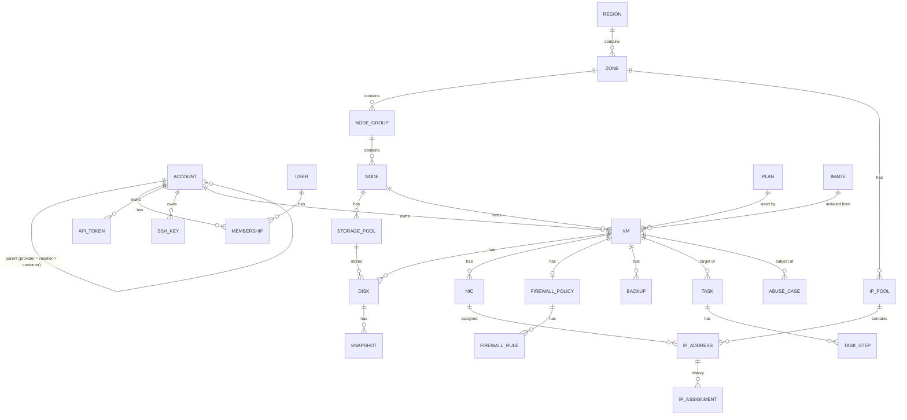

# Data model

The control-plane database is the single source of truth ([ARCHITECTURE invariant 1](../ARCHITECTURE.md#invariants)). Agents keep only rebuildable caches.

## Conventions

| Topic | Rule |
|---|---|
| Primary keys | UUIDv7 (`uuid` column), time-ordered |
| Public IDs | Prefixed, base32 of the UUIDv7: `vm_01J9Z…`, `node_…`, `acct_…`. Prefix table below. API never exposes raw UUIDs |
| Timestamps | `timestamptz`, UTC, RFC 3339 in the API. Columns `created_at`, `updated_at` on every table |
| Sizes | Integer bytes (`bigint`). Bandwidth in bits/s. Never floats for sizes |
| Money | Integer minor units + ISO 4217 currency (`amount_minor`, `currency`) |
| Optimistic concurrency | `version bigint` on every mutable table; API `ETag`/`If-Match` maps to it |
| Soft delete | Customer-visible resources get `deleted_at`; rows are kept for audit, IP history and billing. Hard deletes only by retention jobs |
| Tenancy | Every customer-owned row has `account_id`. Repository functions take an `AuthzContext` and add the tenant filter; raw queries without it are rejected in review and by a lint test ([TESTING.md](./TESTING.md#tenant-isolation-suite)) |
| Enums | Stored as `text` with a `CHECK` constraint; Rust enums with `serde(rename_all = "snake_case")` |
| JSON columns | Only for opaque, versioned payloads (task input/output, setting values, event payloads). Queried fields are real columns |
| Migrations | `sqlx` migrations, forward-only, one per PR, must run on SQLite (v0.1) and PostgreSQL (v0.2+) |

ID prefixes: `acct` account, `usr` user, `tok` API token, `key` SSH key, `rgn` region, `zone` zone, `ngrp` node group, `node` node, `pool` storage pool, `ippool` IP pool, `ip` IP address, `plan` plan, `img` image, `vm` VM, `disk` disk, `nic` NIC, `snap` snapshot, `bkp` backup, `fw` firewall policy, `task` task, `evt` event, `whk` webhook endpoint, `abuse` abuse case.

## Entity map

## Tenancy and identity

### `account`
| Column | Type | Notes |
|---|---|---|
| `id` | uuid | |
| `kind` | `provider` \| `reseller` \| `customer` | Exactly one `provider` row per installation |
| `parent_id` | uuid → account | `null` only for the provider. Reseller → provider; customer → reseller or provider |
| `name` | text | |
| `status` | `active` \| `suspended` \| `closed` | Account-level suspension suspends all its VMs ([STATE_MACHINES.md](./STATE_MACHINES.md#suspensions)) |
| `external_ref` | text, nullable | ID in the billing system (WHMCS client id…), unique per parent |
| `quota` | jsonb | Reseller/customer limits: vCPUs, RAM, disk, VMs, IPv4 count. `null` = unlimited |

### `account_identity_history`
Append-only snapshot of the customer's legal identity, so IP history answers "who was this customer **at that time**".

| Column | Type |
|---|---|
| `account_id` | uuid |
| `valid_from` | timestamptz |
| `legal_name`, `document_id` (CPF/CNPJ/VAT), `email`, `phone`, `address` | text (encrypted at rest, see [SECURITY_MODEL.md](./SECURITY_MODEL.md#secrets)) |

### `user`, `membership`, `api_token`, `ssh_key`, `session`
| Table | Key columns |
|---|---|
| `user` | `email` (unique, citext), `password_hash` (Argon2id), `totp_secret_ref`, `webauthn_credentials` (jsonb), `status` |
| `membership` | `user_id`, `account_id`, `role` (`owner` \| `admin` \| `operator` \| `member` \| `read_only`). A user may belong to several accounts |
| `api_token` | `account_id`, `created_by`, `name`, `prefix` (first 8 chars, shown), `hash` (SHA-256), `scopes` (text[]), `expires_at`, `last_used_at`, `allowed_cidrs` |
| `ssh_key` | `account_id`, `name`, `public_key`, `fingerprint` (unique per account) |
| `session` | `user_id`, `hash`, `expires_at`, `last_seen_at`, `ip`, `user_agent`, `step_up_until` |

## Infrastructure

| Table | Key columns |
|---|---|
| `region` | `slug` (e.g. `br-sp`), `name` |
| `zone` | `region_id`, `slug`, `name` (one datacenter / facility) |
| `node_group` | `zone_id`, `name`, `cpu_vendor` (`intel`\|`amd`), `cpu_baseline` (libvirt CPU XML, computed, see [COMPUTE.md](./COMPUTE.md)), `tags` |
| `node` | `node_group_id`, `hostname`, `status` ([STATE_MACHINES.md](./STATE_MACHINES.md#node)), `agent_version`, `component_versions` (jsonb: kernel, qemu, libvirt, ovmf, ovs, ovn, frr), `cpu_model`, `cpu_flags` (text[]), `sockets`, `cores`, `threads`, `ram_bytes`, `numa_topology` (jsonb), `bmc` (jsonb + secret ref), `last_heartbeat_at`, `cert_serial` |
| `storage_pool` | `node_id` (null for `replicated`), `class` (`local`\|`replicated`), `backend` (`lvm_thin`\|`ceph_rbd`), `layout` (`jbod`…, only `local`), `device_paths` (text[]), `capacity_bytes`, `allocated_bytes`, `used_bytes`, `metadata_used_pct`, `status` |
| `ip_pool` | `zone_id`, `family` (`v4`\|`v6`), `prefix` (cidr), `gateway`, `assign_prefix_len` (32 / 64), `kind` (`public`\|`private`), `netbox_ref` |
| `ip_address` | `ip_pool_id`, `address` (cidr: /32 or /64), `status` ([STATE_MACHINES.md](./STATE_MACHINES.md#ip-address)), `nic_id` (nullable), `account_id` (nullable), `cooldown_until`, `rdns` |

## Catalog

| Table | Key columns |
|---|---|
| `plan` | `account_id` (owner: provider or reseller), `name`, `vcpus`, `cpu_class` (`shared`\|`dedicated`), `ram_bytes`, `hugepages` (bool), `storage_class`, `root_disk_bytes`, `disk_qos` (jsonb `DiskQos`), `traffic_quota_bytes` (nullable), `overage_action` (`throttle`\|`suspend`), `ipv4_count`, `ipv6_count`, `backup_schedule` (jsonb, nullable), `visibility` (`public`\|`private`) |
| `image` | `account_id` (null = global), `kind` (`template`\|`iso`), `os_family`, `os_version`, `arch`, `format` (`qcow2`\|`raw`\|`iso`), `size_bytes`, `sha256`, `source_url`, `cloud_init` (bool), `min_disk_bytes`, `boot` (`bios`\|`uefi`\|`uefi_secure`), `status` |

## Compute

### `vm`
| Column | Type | Notes |
|---|---|---|
| `id`, `account_id` | uuid | |
| `name`, `hostname` | text | `hostname` RFC 1123 |
| `plan_id` | uuid | Resources copied below at create/resize so plan edits don't change running VMs |
| `vcpus`, `ram_bytes`, `cpu_class`, `hugepages` | | Effective resources |
| `node_id` | uuid, nullable | `null` before placement |
| `image_id` | uuid | Last installed image |
| `lifecycle` | enum | See [STATE_MACHINES.md](./STATE_MACHINES.md#vm) |
| `power_desired` | `running` \| `stopped` | What control wants |
| `power_observed` | `running` \| `stopped` \| `paused` \| `crashed` \| `unknown` | Last report from the agent |
| `power_observed_at` | timestamptz | |
| `operation` | enum, nullable | Current mutating workflow kind |
| `operation_task_id` | uuid, nullable | Lock holder ([TASKS.md](./TASKS.md#resource-locks)) |
| `suspensions` | jsonb array of `{reason, by, at, note}` | `billing` \| `abuse` \| `admin` \| `quota` |
| `rescue` | bool | |
| `cpu_model` | text | Resolved libvirt CPU definition, fixed until cold upgrade |
| `machine_type` | text | e.g. `pc-q35-10.2`; pinned for migration safety |
| `boot_mode` | `bios` \| `uefi` \| `uefi_secure` | |
| `firewall_policy_id` | uuid, nullable | |
| `user_data` | text, nullable | cloud-init, encrypted |
| `labels` | jsonb | Customer key/values |
| `version`, `created_at`, `updated_at`, `deleted_at` | | |

| Table | Key columns |
|---|---|
| `disk` | `vm_id` (nullable for detached volumes), `account_id`, `storage_pool_id`, `class`, `size_bytes`, `bus` (`virtio_blk`), `boot_order`, `qos` (jsonb), `backend_ref` (LV name / RBD image), `status` |
| `nic` | `vm_id`, `mac` (unique, locally administered `52:54:00` prefix, generated), `network_mode` (`routed`\|`ovn`), `tap_name` (`kt<short-id>`, ≤ 15 chars), `queues`, `rate_limit` (jsonb), `ovn_port` (nullable) |
| `firewall_policy`, `firewall_rule` | As `FirewallPolicy` / `FirewallRule` in [ARCHITECTURE.md](../ARCHITECTURE.md#firewall), one row per rule with `priority` |
| `snapshot` | `disk_id`, `name`, `size_bytes`, `backend_ref`, `status` |
| `backup` | `vm_id`, `kind` (`full`\|`incremental`), `parent_id`, `repository`, `size_bytes`, `chunks`, `status`, `started_at`, `finished_at`, `expires_at` |
| `console_session` | `vm_id`, `user_id`, `kind` (`vnc`\|`serial`), `token_hash`, `opened_at`, `closed_at`, `client_ip` |

## IP history (legal and abuse lookups)

`ip_assignment` is **append-only**. It is written in the same transaction that changes `ip_address.nic_id`.

| Column | Type | Notes |
|---|---|---|
| `id` | uuid | |
| `address` | cidr | Copied, so history survives pool deletion |
| `vm_id`, `nic_id`, `account_id` | uuid | |
| `mac` | macaddr | |
| `assigned_at` | timestamptz | |
| `released_at` | timestamptz, nullable | `null` = still assigned |
| `assigned_by_task_id`, `released_by_task_id` | uuid | |

Rules:
- UPDATE is allowed only to set `released_at` once; DELETE only by the retention job after `network.ip_history_retention` (default `365d`; set it to your legal requirement).
- A released IP enters `cooldown` for `network.ip_cooldown` (default `7d`) before reuse, so abuse reports and DNS caches don't hit the next customer.
- Lookup: `GET /v1/admin/ip-history?address=203.0.113.7&at=2026-10-01T12:00:00Z` returns the assignment row joined with the `account_identity_history` row valid at that instant. Each lookup is itself audited.
- IPv6: lookups match any address inside the assigned `/64`.

## Operations

| Table | Key columns |
|---|---|
| `task`, `task_step` | See [TASKS.md](./TASKS.md#schema) |
| `audit_log` | `id`, `at`, `actor` (user / token / system / agent), `account_id`, `action` (`vm.stop`…), `target` (public id), `request_id`, `ip`, `before` / `after` (jsonb, secrets redacted), `prev_hash`, `hash` (SHA-256 chain) |
| `event` | Outbox: `id`, `type` (`vm.created`…), `account_id`, `payload`, `created_at`, `published_at`. Written in the same transaction as the change |
| `webhook_endpoint` | `account_id`, `url`, `secret_ref`, `events` (text[]), `status` |
| `webhook_delivery` | `endpoint_id`, `event_id`, `attempt`, `status_code`, `next_attempt_at`, `delivered_at` |
| `setting` | See [CONFIGURATION.md](./CONFIGURATION.md#scopes-and-resolution) |
| `abuse_case`, `abuse_signal` | See [ABUSE.md](./ABUSE.md#data) |
| `secret` | `id`, `purpose`, `ciphertext`, `dek_wrapped`, `kek_id`, `created_at`, `rotated_at` |
| `agent_cert`, `enrollment_token` | See [SECURITY_MODEL.md](./SECURITY_MODEL.md#agent-pki) |

## Metering

| Table | Key columns |
|---|---|
| `traffic_5m` | `vm_id`, `nic_id`, `bucket_start`, `rx_bytes`, `tx_bytes` (unique on `nic_id, bucket_start`, so replays are idempotent) |
| `traffic_monthly` | `vm_id`, `month`, `rx_bytes`, `tx_bytes`, `p95_bps` |
| `usage_hourly` | `vm_id`, `hour`, `vcpus`, `ram_bytes`, `disk_bytes`, `ipv4_count`, `state` (for hourly billing, v0.7) |

Time-series metrics (graphs) are **not** in this database; see [METRICS.md](./METRICS.md).
