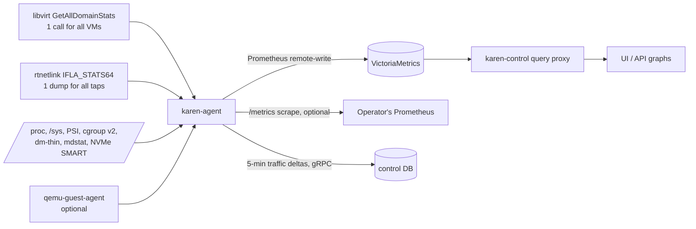

# Metrics

Goal: collect as much as is useful, as long as it is cheap for the hypervisor and the metrics store. Everything here is collected **without forking processes**: one bulk libvirt call, one netlink dump and a few file reads per interval.

## Pipeline



- Interval: `metrics.vm_interval` and `metrics.node_interval` (default `10s`, minimum `5s`). SMART: `metrics.smart_interval` (default `5m`).
- Without `metrics.remote_write_url`, the agent still serves `/metrics` locally (bound to the management interface) and graphs are hidden in the UI. Billing (traffic) never depends on the metrics store.
- Counters are exported as counters (`_total`), never pre-computed rates; rates are computed at query time.

## VM metrics

Labels: `vm_id` (public id), plus `disk_id`, `nic_id`, `vcpu` where noted. No customer-controlled strings in labels.

| Metric | Source | Notes |
|---|---|---|
| `karen_vm_cpu_seconds_total` | libvirt `cpu.time` | Total guest CPU time |
| `karen_vm_cpu_user_seconds_total`, `karen_vm_cpu_system_seconds_total` | `cpu.user`, `cpu.system` | |
| `karen_vm_vcpu_seconds_total{vcpu}` | `vcpu.N.time` | Per vCPU, only when `metrics.per_vcpu` (default `false`) |
| `karen_vm_cpu_steal_seconds_total` | Σ `vcpu.N.delay` (time runnable but waiting for a host CPU) | **Steal time seen from the host.** Key metric to prove no CPU contention |
| `karen_vm_vcpus` | domain info | Gauge |
| `karen_vm_memory_bytes` | plan / `balloon.maximum` | Assigned |
| `karen_vm_memory_balloon_bytes` | `balloon.current` | Current balloon target |
| `karen_vm_memory_rss_bytes` | `balloon.rss` | Host RAM actually used by the VM |
| `karen_vm_memory_guest_usable_bytes`, `…_unused_bytes`, `…_available_bytes`, `…_disk_caches_bytes` | balloon stats | Guest view (needs balloon driver) |
| `karen_vm_memory_swap_in_bytes_total`, `…_swap_out_bytes_total` | balloon stats | Guest swapping = undersized plan |
| `karen_vm_memory_major_faults_total` | balloon stats | |
| `karen_vm_disk_read_bytes_total{disk_id}`, `…_write_bytes_total` | `block.N.rd/wr.bytes` | |
| `karen_vm_disk_read_ops_total{disk_id}`, `…_write_ops_total`, `…_flush_ops_total` | `block.N.rd/wr/fl.reqs` | IOPS at query time |
| `karen_vm_disk_read_time_seconds_total{disk_id}`, `…_write_time…`, `…_flush_time…` | `block.N.rd/wr/fl.times` | **Latency** = Δtime / Δops |
| `karen_vm_disk_allocated_bytes{disk_id}`, `karen_vm_disk_capacity_bytes` | `block.N.allocation/capacity` | With `discard=unmap`, allocation tracks real usage |
| `karen_vm_disk_throttled_seconds_total{disk_id}` | QEMU throttle stats (QMP) | Time spent waiting on QoS limits ("my disk is slow" answers) |
| `karen_vm_net_rx_bytes_total{nic_id}`, `…_tx_bytes_total`, `…_rx_packets_total`, `…_tx_packets_total` | tap `IFLA_STATS64` | Already specified in [ARCHITECTURE.md](../ARCHITECTURE.md#network-graphs--accounting) |
| `karen_vm_net_rx_dropped_total{nic_id}`, `…_tx_dropped_total`, `…_errors_total` | tap stats | |
| `karen_vm_net_ratelimited_packets_total{nic_id}` | `tc` police / OVN meter counters | |
| `karen_vm_fw_denied_packets_total{nic_id,direction}` | nft rule counters / OVN ACL `n_packets` | |
| `karen_vm_up` | domain state | 1 running, 0 otherwise |
| `karen_vm_uptime_seconds` | domain start time | |

Optional, with `qemu-guest-agent` in the image (`metrics.guest_agent.enabled`, default `false`; polled every `metrics.guest_agent.interval`, default `60s`):

| Metric | Source |
|---|---|
| `karen_vm_fs_size_bytes{mount}`, `karen_vm_fs_used_bytes{mount}` | `guest-get-fsinfo` (mount label limited to the first `metrics.guest_agent.max_mounts`, default 8, sanitized) |
| `karen_vm_guest_agent_up` | ping |

## Node metrics

Labels: `node_id`, plus `device`, `pool_id`, `cpu` where noted.

| Group | Metrics |
|---|---|
| CPU | `karen_node_cpu_seconds_total{mode}`, `karen_node_load1/5/15`, `karen_node_cpu_committed_vcpus`, `karen_node_cpu_sellable_vcpus` |
| Pressure (PSI) | `karen_node_pressure_{cpu,memory,io}_waiting_seconds_total`, `…_stalled_seconds_total` — the best early signal of an overloaded host |
| Memory | `karen_node_memory_{total,available,committed,sellable}_bytes`, `karen_node_hugepages_{total,free}`, `karen_node_ksm_pages_sharing`, `karen_node_ksm_pages_shared`, `karen_node_swap_used_bytes` |
| Storage pools | `karen_pool_{capacity,allocated,used}_bytes{pool_id}`, `karen_pool_metadata_used_ratio{pool_id}`, `karen_pool_overcommit_ratio` |
| RAID | `karen_md_degraded{device}`, `karen_md_sync_progress_ratio` |
| NVMe health | `karen_nvme_temperature_celsius{device}`, `karen_nvme_percentage_used{device}` (wear), `karen_nvme_available_spare_ratio`, `karen_nvme_media_errors_total`, `karen_nvme_critical_warning`, `karen_nvme_{read,write}_bytes_total` |
| Disk devices | `karen_node_disk_{read,write}_{bytes,ops,time_seconds}_total{device}` |
| Network | `karen_node_net_{rx,tx}_{bytes,packets,dropped,errors}_total{device}`, `karen_node_conntrack_entries`, `karen_node_conntrack_max` |
| OVS (ovn mode) | `karen_ovs_datapath_{hit,missed,lost}_total`, `karen_ovs_datapath_flows` — `missed`/`lost` spikes reveal flow-miss storms (DDoS) |
| BGP (FRR) | `karen_bgp_session_up{peer}`, `karen_bgp_prefixes_received{peer}` |
| Agent | `karen_agent_collect_duration_seconds`, `karen_agent_stream_connected`, `karen_agent_journal_pending`, `karen_agent_build_info{version}` |
| Hardware (optional, via BMC) | `karen_node_power_watts`, `karen_node_temperature_celsius{sensor}` (Redfish, `metrics.bmc.enabled`, default `false`, every `60s`) |

## Control-plane metrics

`karen_api_requests_total{route,code}`, `karen_api_request_duration_seconds` (histogram), task metrics from [TASKS.md](./TASKS.md#observability), `karen_agents_connected`, `karen_webhook_deliveries_total{status}`, `karen_control_backup_last_success_timestamp`, `karen_db_pool_{in_use,idle}`.

## Cost budget

| Item | Estimate (to be confirmed by the load test) |
|---|---|
| Series per VM | ~35 (1 disk, 1 NIC, no per-vCPU) |
| 5,000 VMs at 10 s | ~175k active series, ~17.5k samples/s |
| VictoriaMetrics disk | ~1 GB/day, ~100 GB for 90 days |
| Agent CPU, 200 VMs at 10 s | < 1 % of one core (most of the cost is libvirt/QEMU answering the stats call) |

Acceptance criteria for v0.3 ([TESTING.md](./TESTING.md#load-tests)): agent collection for 200 VMs < `200ms` wall time and < `1 %` of one core averaged; VictoriaMetrics ingest of 5,000 simulated VMs stable for 24 h.

## Retention

- Raw samples: `metrics.retention` (default `90d`).
- Long-term: optional vmagent stream aggregation to 5-minute series (`metrics.longterm.enabled`, default `false`, retention `metrics.longterm.retention`, default `2y`).
- Billing traffic lives in the control DB, not here ([DATA_MODEL.md](./DATA_MODEL.md#metering)).

## Query API

Customers never send PromQL. The API exposes named metrics and builds the query server-side with `vm_id` injected:

```
GET /api/v1/vms/{id}/metrics?metric=cpu_usage&range=24h&step=60s
→ { "metric": "cpu_usage", "unit": "percent", "step": 60,
    "series": [ { "labels": {}, "points": [[1760018400, 12.5], ...] } ] }
```

| Named metric | Unit | Computed as |
|---|---|---|
| `cpu_usage` | percent of assigned vCPUs | rate(cpu_seconds) / vcpus |
| `cpu_steal` | percent | rate(cpu_steal_seconds) / vcpus |
| `memory_used` | bytes | assigned − guest unused (or RSS without balloon stats) |
| `disk_iops` | ops/s | per disk, read/write series |
| `disk_throughput` | bytes/s | per disk |
| `disk_latency` | seconds | Δtime / Δops per disk |
| `disk_usage` | bytes | guest fs used (guest agent) or LV allocation |
| `net_throughput` | bits/s | per NIC, rx/tx |
| `net_packets` | packets/s | per NIC |
| `fw_denied` | packets/s | |

- `range` ∈ `1h`, `6h`, `24h`, `7d`, `30d` (and custom up to `metrics.retention`); `step` auto-picked if absent, minimum `metrics.vm_interval`; max 1,500 points per series.
- Which named metrics a customer sees is `metrics.customer_visible` (per plan). Admins see all, plus node metrics.
