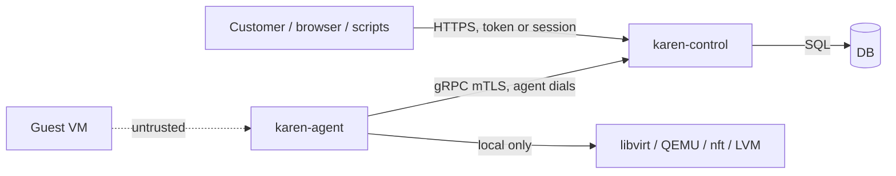

# Security model

Threats we design against, in order: (1) a customer reaching another customer's VM, data or console; (2) a guest escaping to the host; (3) a stolen credential (token, agent cert, admin session); (4) a compromised node attacking control or other nodes; (5) loss of the control database.

## Trust boundaries

- Control trusts no node blindly: an agent can only report about and act on **its own** node (`node_id` bound to its certificate). Inventory claiming another node's VM is rejected and alerts.
- Agents trust only control's CA and accept only typed step messages ([API.md](./API.md#agent-protocol)). No generic command execution exists.
- Guests are hostile. Nothing from a guest (guest-agent output, hostnames, metrics) is used in shell commands, file paths or XML without strict validation.

## Agent PKI

| Item | Rule |
|---|---|
| CA | Created by `karen-control init`: an offline-capable **root** (ECDSA P-256, 10 y) and an online **intermediate** (2 y) used for signing. Root key can be exported and removed from the server (`karen ca export-root --remove`) |
| Enrollment token | One-time, `security.enrollment_token_ttl` (default `1h`), stored hashed, optionally bound to an expected hostname and source CIDR. Created via `POST /admin/nodes/enrollment-tokens` |
| Key generation | The agent generates its private key locally (`/var/lib/karen-agent/tls/key.pem`, mode `0600`, owner `karen-agent`); only a CSR leaves the node |
| Certificate | Validity `security.agent_cert_ttl` (default `30d`), SAN `URI:karen:node:<node_id>`; renewed automatically at 2/3 of lifetime via `RenewCertificate` |
| Revocation | `agent_cert` table lists serials; control checks on every connection. Retiring or deleting a node revokes its cert immediately and drops the stream. Short lifetimes bound the risk if revocation is missed |
| TLS | 1.3 only, no session resumption across cert rotation, ALPN `h2` |
| Control's server cert | From the same CA (agents pin the CA) or a public ACME cert for the API; agent channel always uses the internal CA |

`karen-metal` and `karen-edge` use the same enrollment and PKI.

## Secrets

- Stored in the `secret` table with **envelope encryption**: each secret has a random data key (DEK, AES-256-GCM); the DEK is wrapped by the key-encryption key (KEK).
- KEK source (bootstrap config `secrets.kek`): `file:///etc/karen/kek` (default, `0400`), `systemd-creds`, `env`, or a plugin (HashiCorp Vault Transit / cloud KMS). KEK rotation re-wraps DEKs without re-encrypting data (`karen secrets rotate-kek`).
- Encrypted: BMC credentials, Ceph keys, S3 credentials, SMTP passwords, webhook secrets, TOTP secrets, cloud-init `user_data`, customer identity fields (`account_identity_history`).
- Hashed (never recoverable): passwords (Argon2id, m=64 MiB, t=3, p=1), API tokens and session ids (SHA-256 of 256-bit random values), enrollment and console tokens.
- Secrets never appear in logs, audit `before/after`, task input/output, error messages or metrics labels. A `Secret<T>` wrapper type in `karen-core` has no `Debug`/`Display`/`Serialize` that reveals contents.
- The KEK and CA keys are backed up **separately** from database backups ([OPERATIONS.md](./OPERATIONS.md#control-database-backup)).

## Users and sessions

- Login: email + password, then 2FA (TOTP or WebAuthn) when required by `security.require_2fa` (default `admins`).
- Session cookie as in [API.md](./API.md#2-authentication-and-authorization); idle timeout `security.session_idle_timeout` (default `12h`), absolute `30d`.
- Step-up re-auth for sensitive actions (`10m` window).
- Brute force: per-account and per-IP exponential lockout (`security.login.*` settings).
- Password reset tokens: single use, `30m`, invalidate all sessions on use.

## API tokens

- Format `krn_<8-char prefix>_<43-char secret>`; the prefix is stored in clear for display and lookup, the full token hashed.
- Scopes, optional expiry, optional `allowed_cidrs`; `last_used_at` and IP recorded.
- Shown once at creation. Secret-scanning friendly prefix (`krn_`).

## Console

1. Customer calls `POST /vms/{id}/console` (scope `vm:console`, not suspended unless `suspend.allow_console`, default `true`).
2. Control creates a token: 256-bit random, hashed in `console_session`, **single use**, must be opened within `security.console_token_ttl` (default `60s`), bound to user, VM and client IP.
3. Browser opens `wss://<panel>/console/<token>`; control validates and sends `ConsoleOpen` to the agent over the existing mTLS stream.
4. The agent connects to QEMU's VNC/serial on a **Unix socket** (never a TCP port) and relays bytes.
5. Session ends at `security.console_max_session` (default `8h`), on VM lock changes that require it (reinstall), or when the user's access is revoked. Open/close are audited.

No node exposes VNC, SPICE or serial on the network.

## Tenant isolation

Defence in depth, each layer tested ([TESTING.md](./TESTING.md#tenant-isolation-suite)):

| Layer | Mechanism |
|---|---|
| API | One authorization module (`authz::check(ctx, action, resource)`); handlers can't query without an `AuthzContext`; outside-tree ⇒ `404` |
| Data | Repository layer adds `account_id` / tree filter; PostgreSQL row-level security as a second net (v0.2+) |
| Network | Anti-spoof always on (MAC + IP), per-VM chains/Port_Groups; no L2 between customers in `routed`; VPCs isolated by OVN logical switches |
| Compute | QEMU per VM as unprivileged user, AppArmor (libvirt sVirt) profile per domain, seccomp sandbox, nested virt off ([ARCHITECTURE.md](../ARCHITECTURE.md#compute)), KSM off by default ([COMPUTE.md](./COMPUTE.md#ksm)) |
| Storage | One LV / RBD image per disk; LV names derived from ids, never from user input; discard/zeroing on delete (`lvremove` of thin LV + `blkdiscard` for full-disk releases) so the next customer never reads old data |
| Metrics | Server-side injection of `vm_id` labels; customers can't send PromQL selectors ([METRICS.md](./METRICS.md#query-api)) |
| Console | Single-use tokens, Unix sockets only |

## Host hardening

As in [SECURITY.md](../../SECURITY.md#host-hardening-baseline), checked at enrollment and every reconcile; a failed check moves the node to `failed_checks` (new nodes) or raises an alert and stops placement (existing nodes).

## Audit log

- Every API write, admin action, setting change, console session, IP-history lookup and login (success/failure) is an `audit_log` row.
- Rows are hash-chained (`hash = SHA-256(prev_hash || row)`); `karen audit verify` detects tampering. Optional export to syslog/S3 (`audit.export.*`).
- Retention `audit.retention` (default `365d`).

## Supply chain

- `cargo-deny` (licenses: deny AGPL/GPL linking; advisories; duplicate versions), `cargo-audit` in CI.
- Release binaries reproducible-ish (locked deps, `--locked`), signed with Sigstore cosign; apt repository signed.
- KAREN-built OVS/OVN packages track upstream security releases the same day ([ARCHITECTURE.md](../ARCHITECTURE.md#host-platform)).
