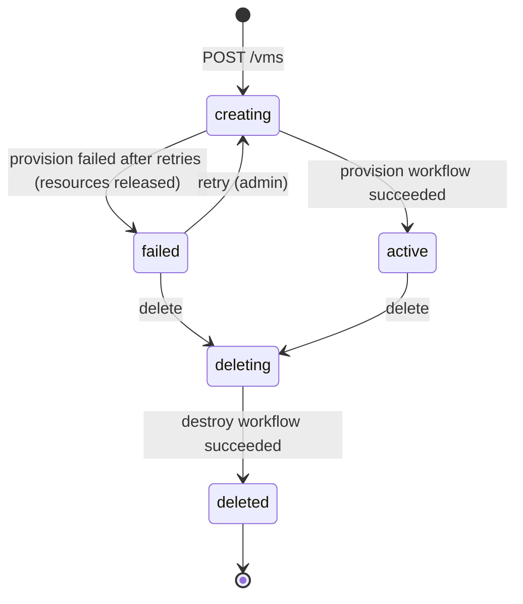
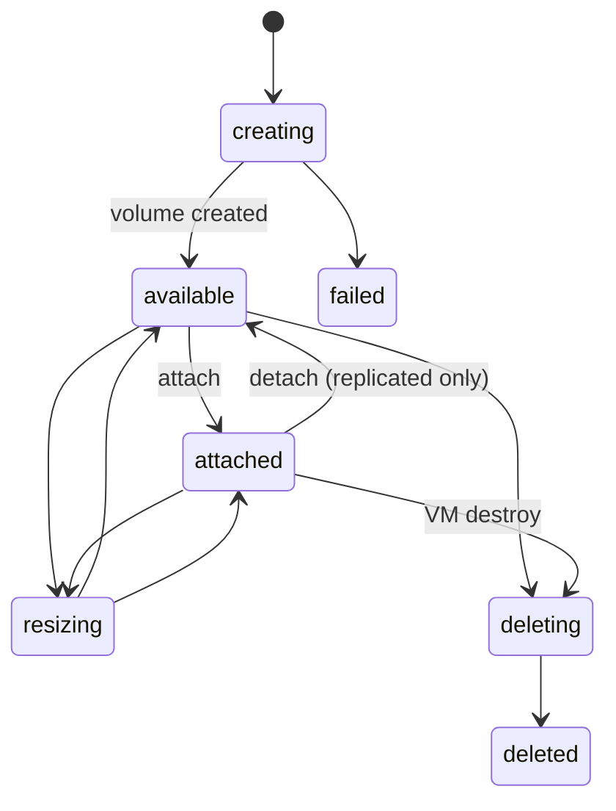
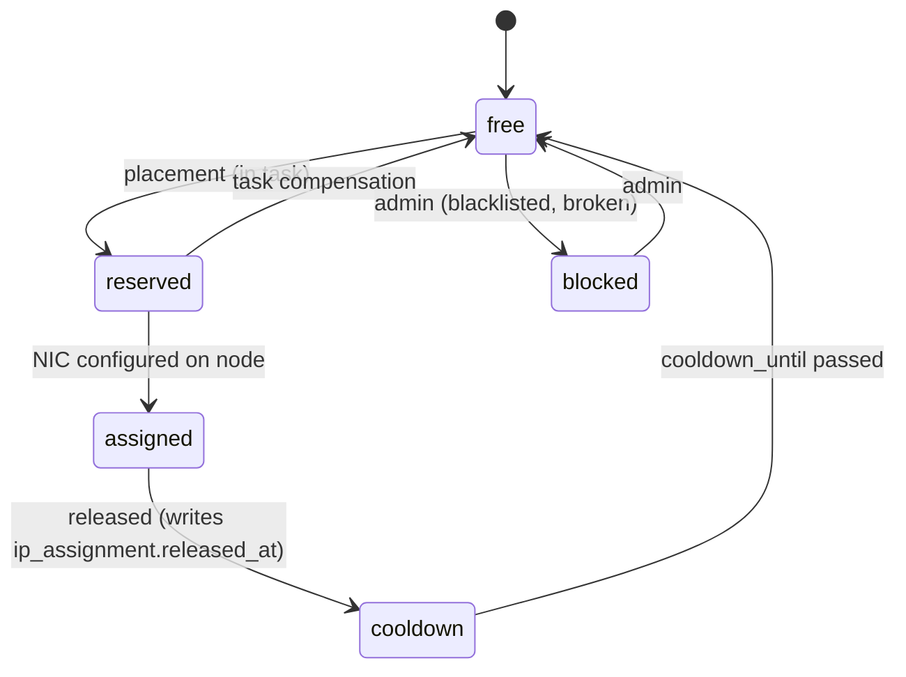
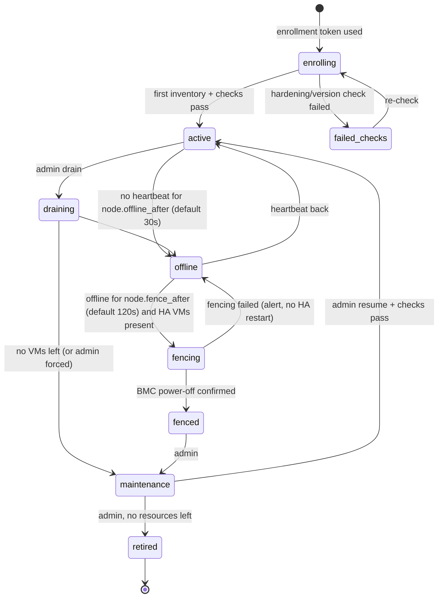

# State machines

Every lifecycle is an explicit enum with a transition table in `karen-core`. A transition not listed here is a bug and MUST be rejected (`409 invalid_state`). Transitions happen only inside tasks ([TASKS.md](./TASKS.md)), except where marked *direct*.

## VM

A VM's state is four independent fields, not one big enum. This avoids states like `running_suspended_migrating`.

| Field | Values | Owner |
|---|---|---|
| `lifecycle` | `creating` → `active` → `deleting` → `deleted`; `failed` | Control |
| `power_desired` | `running` \| `stopped` | Control (user intent) |
| `power_observed` | `running` \| `stopped` \| `paused` \| `crashed` \| `unknown` | Agent reports |
| `operation` | `null` or one of the operations below | Task that holds the VM lock |
| `suspensions` | set of `billing` \| `abuse` \| `admin` \| `quota` | Control |
| `rescue` | bool | Control |

### Lifecycle

- `creating`: placed, disks/IPs reserved, domain being defined and first boot.
- `failed`: provisioning gave up. All node-side resources are released by compensation; the row stays for the customer to see and delete.
- `deleting`: no other operation may start. The VM is never left half-deleted: the destroy workflow is retried until it succeeds, then the row gets `deleted_at`.

### Operations (while `lifecycle = active`)

Only one operation at a time (VM lock). Allowed starting conditions:

| Operation | Starts when `power_observed` is | Blocked by suspension | Result |
|---|---|---|---|
| `start` | `stopped`, `crashed` | yes | `running` |
| `stop` (ACPI, then force after `vm.stop_timeout`, default `120s`) | `running`, `paused` | no | `stopped` |
| `force_stop` | `running`, `paused`, `crashed` | no | `stopped` |
| `reboot` (ACPI) / `reset` (hard) | `running` | yes | `running` |
| `reinstall` | any | yes | `running` or previous power |
| `resize` (CPU/RAM/disk grow) | `stopped` (hot-add when supported, config) | yes | previous power |
| `migrate` (live) | `running` | no (admin/system only) | `running` on new node |
| `migrate_cold` | `stopped` | no | `stopped` on new node |
| `snapshot_create` / `snapshot_restore` | any / `stopped` | create: no; restore: yes | — |
| `backup` | any | no | — |
| `rescue_enter` / `rescue_exit` | any | yes | `running` |
| `suspend` / `unsuspend` | any | — | see below |
| `cpu_model_upgrade` | applied at next cold boot | no | — |

"Blocked by suspension" applies to customer-initiated requests; provider admins can override.

### Power reconciliation

- `power_desired` changes **directly** (in the API transaction) together with enqueuing the matching task.
- If `power_observed ≠ power_desired` with no operation running for longer than `tasks.reconcile_interval`, the reconciler enqueues `start`/`stop` ([TASKS.md](./TASKS.md#reconciliation)).
- A guest that shuts itself down: the agent reports `stopped`; control sets `power_desired = stopped` (customer intent inferred from the guest). Exception: `crashed` keeps `power_desired = running` and the reconciler restarts it if `vm.restart_on_crash` (default `true`).
- `unknown` (node not heartbeating) never triggers actions on the VM. Only node fencing ([Node](#node)) may lead to HA restart for `replicated` VMs.

### Suspensions

- Any non-empty `suspensions` set ⇒ the suspension action is applied. Action per reason is a setting: `suspend.<reason>.action` = `stop` (default) \| `isolate_network` (VM keeps running; only console and the provider's management CIDRs reach it) \| `none` (flag only).
- Removing the last reason undoes the action and restores `power_desired` as it was before suspension (stored in the suspension entry).
- Account suspension adds the `billing` or `admin` reason to every VM of the account.

## Disk

`local` disks are always `attached` to their VM; `detach` is rejected for them.

## IP address

- `reserved` rows carry the task id; a reservation older than the task's lease plus `5m` with no live task is freed by the reconciler.
- An IP is never assigned to two NICs: unique partial index on `ip_address(nic_id)` where status in (`reserved`,`assigned`) plus `address` uniqueness.

## Node

- The scheduler places only on `active` nodes.
- `offline` is not a failure of the VMs; they keep running. No action on `local` VMs.
- HA restart of `replicated` VMs happens only from `fenced` ([ARCHITECTURE.md](../ARCHITECTURE.md#storage-classes) rule 5).

## Task

See [TASKS.md](./TASKS.md#task-states).
