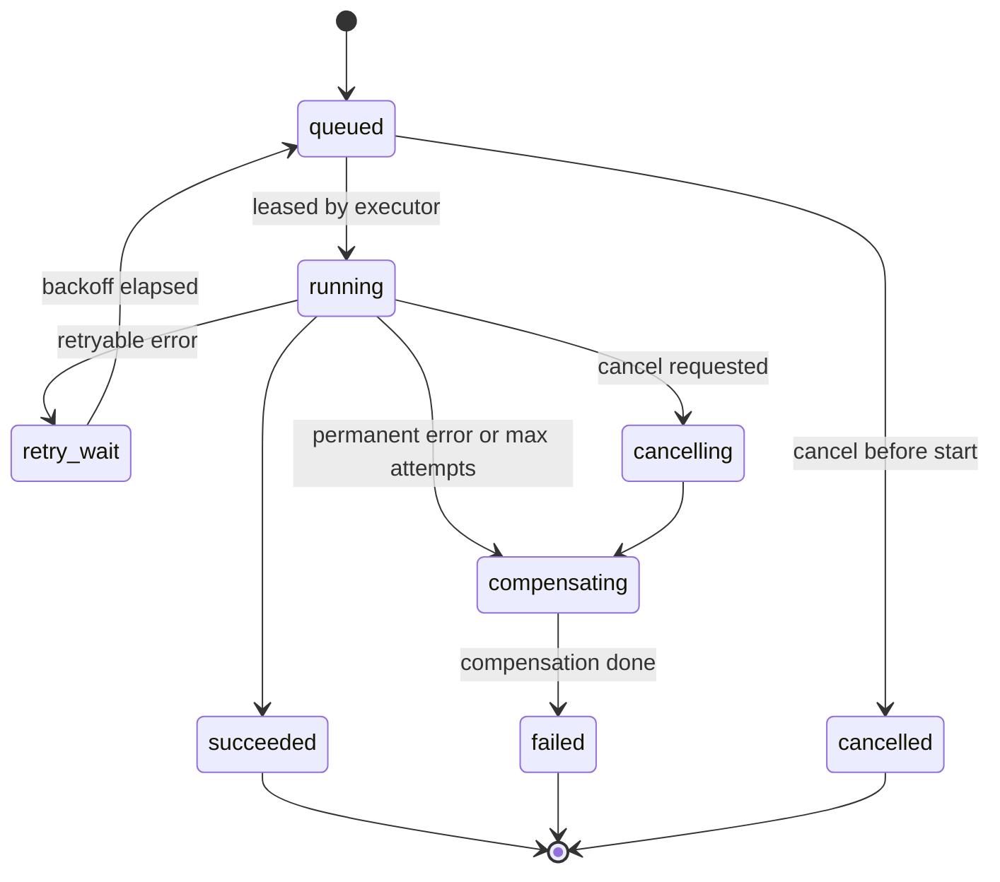

# Task queue

Every change to real infrastructure (libvirt, LVM, nftables, OVN, Ceph, BMC) runs as a **task**. API handlers never touch infrastructure; they validate, write intent, enqueue, and return `202`.

## Design goals

1. **Durable:** a task survives control or agent restarts and resumes or fails cleanly.
2. **Exactly-once effect** through idempotent steps (delivery is at-least-once).
3. **No double owner:** one live executor per task, enforced by leases with fencing tokens.
4. **No conflicting work on one resource:** per-resource locks.
5. **Backpressure:** per-node and per-kind concurrency limits.
6. **Self-healing:** a reconciler compares desired and observed state and fixes drift even if a task was lost.
7. **No extra infrastructure:** the queue lives in the control database. No Redis, RabbitMQ or Kafka.

## Why the database, not a broker

Load at the v1.0 target (50 nodes / 5,000 VMs) is tens of tasks per second at peak (mass reboot, plan migration). PostgreSQL with `FOR UPDATE SKIP LOCKED` handles thousands of dequeues per second on modest hardware, and enqueuing in the **same transaction** as the state change removes the "DB updated but message lost" class of bugs. SQLite (v0.1) has no `SKIP LOCKED`; with a single control process the same dequeue runs inside a `BEGIN IMMEDIATE` transaction (SQLite serializes writers), so the model and the code path above it are identical.

## Model: workflows made of steps

A **task** is a workflow (e.g. `vm.create`). It is a list of **steps**, each executed either by control (DB/IPAM/OVN NB/DNS) or by the agent on a node.

```
vm.create:
  1. control  reserve_resources   (placement, IPs, pool space)
  2. agent    create_disk         (lvcreate thin / rbd create)
  3. agent    write_image         (qemu-img convert template → LV)
  4. agent    configure_network   (tap, routes, proxy ARP/NDP, nftables anti-spoof, tc)
  5. agent    define_domain       (libvirt XML)
  6. agent    start_domain
  7. control  finalize            (lifecycle=active, ip assigned, event vm.created)
compensation (reverse order, for completed steps): undefine, remove network, remove LV, release IPs
```

- Each step has a **deterministic idempotency key**: `"{task_id}:{step_index}:{attempt_epoch}"`. The executor checks the real world first ("does LV `vm-<id>-root` exist with the right size?") and skips work already done. Re-running a step MUST be harmless.
- Steps record output (e.g. LV path) in `task_step.output`, used by later steps and by compensation.
- On permanent failure, completed steps are compensated in reverse order. Compensation steps are also idempotent and are retried until they succeed; a task whose compensation can't finish goes to `failed` with `needs_attention = true` (admin alert).

## Task states



## Schema

`task`
| Column | Notes |
|---|---|
| `id`, `kind` (`vm.create`…), `status` | |
| `account_id`, `target` (public id of the main resource), `requested_by` | |
| `priority` | `0` highest. Default: customer power ops `10`, create/reinstall `20`, admin/migration `30`, backups `50`, reconciler `40` |
| `input` (jsonb, versioned `{"v":1,...}`), `output`, `error` (`{code, message, retryable, details}`) | |
| `node_id` | Node that runs agent steps; `null` for control-only tasks |
| `current_step` | |
| `attempt`, `max_attempts` (default `tasks.max_attempts` = 5) | |
| `run_after` | For backoff and scheduled tasks |
| `lease_owner`, `lease_expires_at`, `lease_epoch` | Fencing token, incremented on every lease |
| `idempotency_key` | From the API `Idempotency-Key` header; unique per account for `24h` |
| `parent_task_id` | For fan-out (e.g. node drain spawns migrations) |
| `needs_attention` | Set when compensation failed |
| `created_at`, `started_at`, `finished_at` | |

`task_step`: `task_id`, `index`, `name`, `executor` (`control`\|`agent`), `status`, `attempt`, `input`, `output`, `error`, `started_at`, `finished_at`.

`task_event`: append-only progress log (`task_id`, `at`, `level`, `message`, `progress_pct`), streamed to the UI.

## Dequeue and leases

```sql
UPDATE task SET status='running', lease_owner=$1, lease_epoch=lease_epoch+1,
       lease_expires_at=now()+interval '30 seconds', started_at=coalesce(started_at, now())
WHERE id = (
  SELECT id FROM task
  WHERE status='queued' AND run_after <= now()
  ORDER BY priority, created_at
  FOR UPDATE SKIP LOCKED LIMIT 1)
RETURNING *;
```

- The executor renews the lease every `10s`. A lease that expires puts the task back to `queued` (attempt not incremented if no step had started).
- Every write by an executor includes `WHERE lease_epoch = $epoch`. A stale executor (paused, partitioned) can't overwrite a newer one: its write affects 0 rows and it aborts.
- Agent steps carry the epoch. The agent rejects step messages with an epoch lower than the last one it saw for that task.

## Agent delivery

- Control pushes agent steps over the agent's persistent gRPC stream ([API.md](./API.md#agent-protocol)): `StepAssign{task_id, step, epoch, idempotency_key, input, deadline}`.
- The agent persists the step to a local journal (`/var/lib/karen-agent/journal`, fsynced) **before** acking, executes it, and sends `StepResult`. After a restart it replays unfinished journal entries (idempotent) and re-sends results.
- If the node is disconnected, the step stays assigned; on reconnect the agent sends `Hello{in_flight: [...]}` and control resumes or re-sends.
- A step has a deadline (per kind, e.g. `write_image` 30m, `define_domain` 2m). After the deadline control asks the agent for status before treating it as failed.

## Retries

- Errors are classified by the executor: `retryable` (timeout, libvirt busy, network) or `permanent` (invalid input, quota, image checksum mismatch).
- Backoff: `min(2^attempt × 2s, 5m)` with ±20 % jitter.
- After `max_attempts` retryable failures the task is treated as permanent.

## Resource locks

- A mutating task acquires the lock on its target by setting `vm.operation_task_id` (or the equivalent column on disk/node) in the enqueue transaction, `WHERE operation_task_id IS NULL`. If the lock is taken, the API returns `409 resource_busy` with the blocking task id.
- Read-only tasks (e.g. `vm.screenshot`) take no lock.
- Locks are released in the same transaction that ends the task.
- Multi-resource tasks (migration: VM + source node slot + destination node slot) acquire locks in a fixed order (node ids ascending, then VM) to avoid deadlocks.

## Concurrency limits

- Per node and kind: `tasks.node_concurrency.<kind>` (create `4`, migrate `2`, backup `2`, other `8`). Checked at dequeue; tasks over the limit stay `queued`.
- Global: `tasks.global_concurrency.migrate` (default `10`) so a drain doesn't saturate the fabric.
- Per account: `tasks.account_concurrency` (default `10`) so one customer's script can't starve others.

## Reconciliation

A background loop every `tasks.reconcile_interval` (default `60s`) per node:

1. Agent sends `Inventory` (domains, power state, LVs, taps, nftables chains, versions).
2. Control diffs it against the DB:
   - VM power differs from `power_desired`, no lock → enqueue `start`/`stop`.
   - Domain on node but not in DB (orphan) → alert; destroy only if `reconcile.destroy_orphans = true` (default `false`).
   - Missing anti-spoof chain or firewall chain → enqueue `network.reapply` (high priority; safety).
   - Expired IP reservations, stuck leases → release.
3. Reconciler tasks are normal tasks (locked, idempotent), so they never race user operations.

## Observability

- Metrics: `karen_tasks_queued{kind}`, `karen_tasks_running{kind,node}`, `karen_task_duration_seconds{kind,status}` (histogram), `karen_task_retries_total{kind,code}`, `karen_tasks_needs_attention`.
- Every task has a `request_id` from the API call that created it, present in logs on control and agent.

## Throughput target

v1.0 acceptance: sustain **50 enqueued tasks/s** for 10 min with 50 simulated nodes, p99 dequeue latency < `500ms`, no lost or duplicated step effects ([TESTING.md](./TESTING.md#load-tests)).
